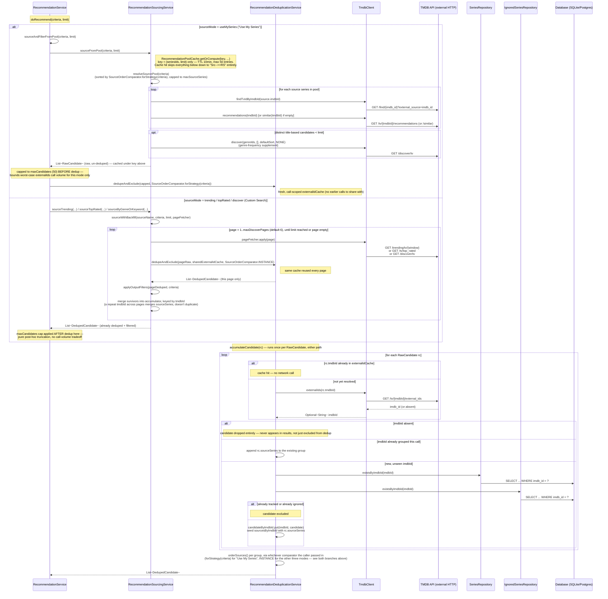
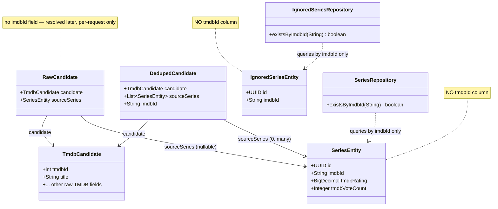

# Recommendation Sourcing/Dedup Flow — Diagram

**Status**: Standalone visual reference, grounded directly against the code on 2026-09-24, corrected 2026-09-25 (`series_spec_068`'s configurable `SourceOrderComparator.forStrategy(criteria)` and the pre-existing `RecommendationPoolCache` were both missing from the original pass — see the two inline fixes and the updated Reading notes). Not yet cross-referenced from `scoring_weight_recommendations.md` (Section 0/0b cover the same flow in prose, and now also cover both of these) — link the two later once this is confirmed useful.

Covers: which class/method calls which, and exactly where a call crosses into TMDB's API or the local database, for the two sourcing paths that feed `RecommendationService.doRecommend` — "Use My Series" (`sourceAndFilterFromPool`) vs. the three direct-TMDB modes (`sourceTrending`/`sourceTopRated`/`sourceByGenreOrKeyword`, all funneled through `sourceWithBackfill`).

## Sequence diagram

## Identity/dedup-key relationships

Grounded by directly reading `SeriesEntity.java`/`IgnoredSeriesEntity.java`/`RawCandidate.java` on 2026-09-24 — neither tracked-series entity carries a `tmdbId` column today, which is why `imdbId` resolution can't be skipped even for a `tmdbId`-first dedup strategy (see the "dedupe on tmdbId?" discussion this diagram accompanies).

## Reading notes

- **Only one path caps before dedup**: "Use My Series" (`sourceAndFilterFromPool`, top branch) is the sole mode where the `maxCandidates` cap is applied to the *raw* list before `dedupeAndExclude` runs — because it's the only mode whose raw pool isn't already deduped/filtered page-by-page beforehand. The other three modes cap *after* `sourceWithBackfill` returns an already-deduped result, so their cap is pure truncation with no call-volume implication.
- **Two caching layers exist today, at different scopes — corrected 2026-09-25, this previously said `externalIdCache` was the only one.**
  - `externalIdCache` is per-request only (a fresh `HashMap` per top-level `doRecommend` call, or shared across `sourceWithBackfill`'s pages within that one call) — nothing persists a `tmdbId → imdbId` mapping across separate requests. A popular show's `external_ids` lookup is repeated on every new request that surfaces it, regardless of mode.
  - `RecommendationPoolCache` (top branch only, see the `Note right of Src` above) is a second, longer-lived layer scoped to "Use My Series" mode's `sourceFromPool` call as a whole — keyed on `(seriesIds, limit)`, TTL 10 minutes, capped at 50 entries. A repeat request with the same selection/limit skips every TMDB call in the top branch entirely (the `findTvIdByImdbId`/`recommendations`/`similar`/genre-supplement loop), not just the `external_ids` lookups — a coarser, cross-request cache sitting *above* `externalIdCache`, not a replacement for it. The other three modes have no equivalent — every request re-runs `sourceWithBackfill` from scratch.
- **A dropped-for-no-`imdbId` candidate is silently invisible**, not merely excluded from dedup grouping — `accumulateCandidate` returns before ever reaching the `candidateByImdbId`/`sourcesByImdbId` maps, so it never reaches ranking, output filters, or the response at all.
- **The comparator used for ordering source series is no longer always `INSTANCE`** (corrected 2026-09-25, `series_spec_068`) — `resolveSourcePool`'s pool-capping sort and `orderSources`' per-candidate multi-source sort both now take whichever comparator the caller resolved: `SourceOrderComparator.forStrategy(criteria)` for "Use My Series" (3 possible strategies, `personalRatingThenDate` still the default), `INSTANCE` unconditionally for the other three modes (moot there, since they never attach a source series to a candidate).
