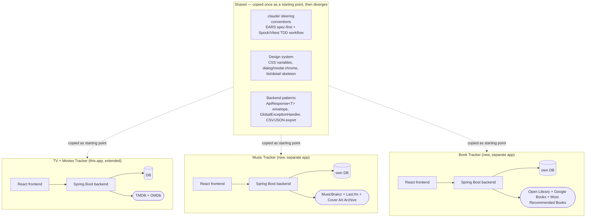
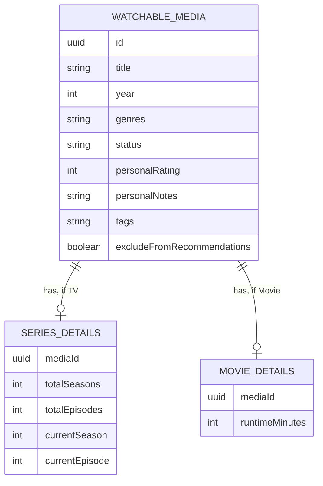
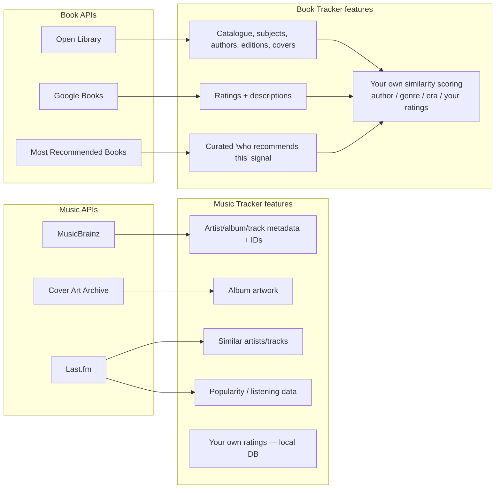

# Idea: Expand into a Media Tracker Suite (Movies, Music, Books)

**Status**: Speculative — a conversation on 2026-08-26, not a commitment, not scheduled, no
timeline. This is **not** an EARS spec and has no acceptance criteria — see
`.claude/steering/ears_format.md` for what a real spec looks like when/if this moves forward. Not
tracked in `.claude/OUTSTANDING_SPECS.md` for the same reason.

## The question

Could this project extend beyond TV series into Movies, Music, and Books? And if so, is that one
unified app, or several?

## Findings

**Movies are close to a drop-in extension.** TMDB and OMDb both cover movies with endpoints that
mirror what `TmdbClient`/`OmdbClient` already call for TV almost 1:1 (`/movie/discover`,
`/movie/{id}/recommendations`, `/movie/{id}/similar`, OMDb's `type=movie`). The friction isn't the
API, it's the data model — `SeriesEntity`'s season/episode fields are TV-specific, so a real
implementation needs either two entities sharing a common base, or one entity with nullable
TV-only columns (see the schema sketch below). Styling, the export feature, CRUD scaffolding, and
the entire recommendation pipeline (sourcing → dedup → filter → rank → assemble, i.e. everything
`tooling_spec_003` extracted into collaborator services) would carry over largely unchanged.

**Music and Books need their own apps — the API landscape genuinely diverges.** Different auth
models, different rate limits, different failure modes, and — critically — a different
*recommendation story*: TMDB gives recommendations for free, music and books mostly don't.

### Music APIs

| Need | API | Notes |
|---|---|---|
| Artist/album/track metadata, IDs, relationships | [MusicBrainz](https://musicbrainz.org/doc/MusicBrainz_API) | Free, open, canonical — plays the role `TmdbGenreTable`-style lookups play today |
| Album artwork | [Cover Art Archive](https://musicbrainz.org/doc/Cover_Art_Archive) | Free, keyless, MBID-based, Internet Archive + MusicBrainz collaboration |
| Similar artists/tracks | [Last.fm](https://www.last.fm/api) | `artist.getSimilar`/`track.getSimilar` — the closest real equivalent to TMDB's `/recommendations`/`/similar`; free for non-commercial use, API-key-only |
| Popularity / listening data | Last.fm | Same API, chart/tag endpoints |
| Your own ratings | your own DB | same pattern as `personalRating`/`personalNotes`/`tags` today |

**Dead end, confirmed**: Spotify's `GET /recommendations` (plus audio-features, audio-analysis,
related-artists) has been blocked for any app not already approved since **November 27, 2024** —
new apps get a 403. Don't reach for it as the obvious default; Last.fm is the live option.

### Book APIs

| Need | API | Notes |
|---|---|---|
| Catalogue, subjects, authors, editions, covers | [Open Library](https://openlibrary.org/developers/api) | Free, no key |
| Ratings, descriptions, additional metadata | [Google Books API](https://developers.google.com/books) | Free tier, key required |
| Curated recommendation signal ("who recommends this book") | [Most Recommended Books](https://mostrecommendedbooks.com/developers) | Verified-recommender / consensus-best-of lists with sources — a real *signal*, not a collaborative-filtering "because you read X" engine |

**Dead end, confirmed**: Goodreads closed its developer API to new applicants in **December
2020** and has been winding it down since — not available for a new app, full stop.

**No book API gives you TMDB-style recommendations for free.** The realistic approach is building
your own scoring from: same author, same subjects/categories, similar publication era, the user's
own ratings, and the Most Recommended Books signal above — genuinely new business logic per app,
not boilerplate that transfers from the TV/Movies recommendation pipeline.

## Recommendation: two apps in practice, not one, and not four

- **TV + Movies**: one domain, one app (this one, extended) — same APIs, same recommendation
  pipeline shape, only the season/episode fields fork.
- **Music**: its own app.
- **Books**: its own app.

Reasoning: cramming all four media types into one entity model risks becoming exactly the kind of
God-entity-with-a-pile-of-domain-specific-nullable-columns problem `tooling_spec_002`/`003`
existed to *undo* at a smaller scale (splitting `SeriesController`/`RecommendationService`).
Adding three more media domains on top of one already-growing schema compounds that pressure
rather than avoiding it. Domain-specific outages (a Spotify-style API lockout, say) also shouldn't
be able to destabilize an unrelated app's CI/deploy.

**What's worth sharing deliberately, across the boundary, without merging the apps**:
- The `.claude/` steering-doc conventions and the EARS-spec-first / Spock+Vitest TDD workflow —
  copy wholesale into each new project rather than reinventing it.
- A design-system starting point (CSS variables, the dialog/modal chrome, the list/detail page
  skeleton) — copied once per app, then free to diverge. Not a shared package; that's real
  coupling overhead for marginal benefit at personal-project scale.
- The `ApiResponse<T>` envelope + `GlobalExceptionHandler` + CSV/JSON export pattern — cheap to
  replicate, not worth a shared library until a third or fourth consumer actually asks for one.

---

## Diagrams

### Suite-level architecture — shared conventions, not shared code

### TV + Movies domain sketch (one of two viable options)

Option A below (shared base + type-specific detail table) keeps one `WATCHABLE_MEDIA` table for
everything both types share (title, rating, status, tags, notes) and forks only the TV-only
season/episode fields into a side table. Option B (not diagrammed) is simpler to query but fully
duplicates every shared field across two parallel entities — a real trade-off to make at
implementation time, not decided here.

### Music & Book API landscape — what feeds what

---

## If this ever moves forward

Follow this project's own process: confirm scope, ground each new spec in the real target API's
actual response shape (not assumption), write it with the `ears-spec` skill, and — per this
project's git workflow — treat "extend to Movies" as a genuinely separate, much smaller effort
from "build a Music Tracker" or "build a Book Tracker," which would be new repos/projects
entirely, not new specs inside this one.
