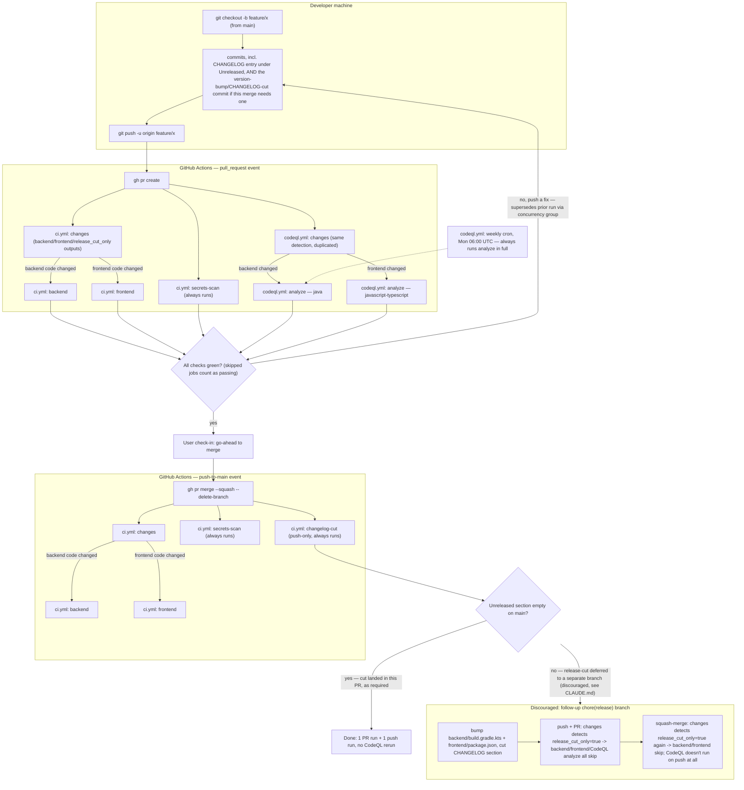

# CI/CD pipeline: git workflow → GitHub Actions

This documents the actual flow from cutting a branch through to a merged, released
`main`, and which GitHub Actions jobs fire at each step. See `.github/workflows/ci.yml`
and `codeql.yml` for the source of truth; this file is the narrative/visual overlay,
and the git-workflow rules it visualizes live in the root `CLAUDE.md` ("Git workflow"
and "Versioning & changelog" sections).

## Triggers, as configured today

- **`ci.yml`**: `push` to `main`, and every `pull_request` (any branch → any base).
  Jobs: `changes`, `backend`, `frontend`, `secrets-scan` run on both events.
  `changelog-cut` is gated to `push` to `main` only. `backend` only runs when
  `changes` says backend code actually changed; `frontend` likewise for frontend
  code; both also skip outright on a release-cut-only diff (see below).
- **`codeql.yml`**: every `pull_request` and a weekly Monday 06:00 UTC cron — **no
  `push: main` trigger** (removed; see "Changes made" below). Runs a 2-entry matrix
  (`java`, `javascript-typescript`) via the `analyze` job; each matrix leg only runs
  when its corresponding side (`backend` for `java`, `frontend` for
  `javascript-typescript`) actually changed, same gating as `ci.yml`.
- Both workflows carry a `concurrency` group keyed on PR number (or ref/run id) so a
  superseded PR run gets cancelled when a new commit lands; pushes to `main` are
  never cancelled.

So a single PR still touches this pipeline twice — once as `pull_request`, once as
`push` when the squash-merge lands on `main` — but CodeQL now only runs once (the PR
run), and each event only runs the backend/frontend/CodeQL work that side of the
diff actually needs.

## Pipeline diagram

## The redundancy that prompted this

For one logical feature that ends up needing a **separate** `chore(release): cut
x.y.z` commit (rather than the version bump/CHANGELOG cut riding in the same PR as
the feature), the full backend+frontend+CodeQL job set used to run **four times**
end-to-end: PR + merge for the feature, then PR + merge again for the release-cut,
with runs 3–4 executing the whole suite against a diff that was only `CHANGELOG.md`
plus two version-number lines (no source, test, or config file changed) — e.g. commit
`385859e`. `changelog-cut` and `secrets-scan` are cheap and were always fine to
rerun; the backend/frontend/CodeQL jobs were the expensive, genuinely redundant part.

## Changes made

1. **Process (`CLAUDE.md`)**: the release-cut step is now explicitly required to
   happen as a commit on the feature branch itself, before merging — a standalone
   `chore(release)` branch/PR is called out as discouraged, not just implicitly
   suboptimal. This is the highest-leverage fix: done consistently, a release-cut-only
   diff never reaches the pipeline at all.
2. **Release-cut detection (`ci.yml`, `codeql.yml`)**: each workflow has its own
   `changes` job that diffs the incoming commit(s) against the merge-base/previous
   commit. If the changed-file set is exactly `{CHANGELOG.md, backend/build.gradle.kts,
   frontend/package.json}` *and* the diff in the latter two touches only the
   `version = "..."` / `"version": "..."` line, it sets `release_cut_only=true` and
   `backend`/`frontend`/`analyze` all skip via `if: needs.changes.outputs.release_cut_only
   != 'true'`. Any other diff shape (including a real dependency bump that happens to
   touch `build.gradle.kts`/`package.json` alongside other lines) falls through to
   running everything, so this can't mask an actual code change. Backstop for when
   (1) doesn't hold — not a substitute for it.
3. **Drop CodeQL's `push: main` trigger (`codeql.yml`)**: a squash-merge lands the
   exact tree its `pull_request` run already analyzed, so the push-triggered rerun
   only ever added coverage for drift between merges — the weekly cron already exists
   for that. This removes 2 CodeQL jobs from *every* merge unconditionally, not just
   release-cut ones.
4. **`concurrency` groups (`ci.yml`, `codeql.yml`)**: a new commit to an open PR
   cancels that PR's in-progress run instead of letting it finish alongside the new
   one. Pushes to `main` are excluded from cancellation (`ci.yml`) or naturally never
   collide (`codeql.yml`, no push trigger left). Unrelated to the release-cut
   duplication specifically, but cheap general hygiene bundled in with the same edit.
5. **Backend/frontend split (`ci.yml`, `codeql.yml`)**: `changes` also gates `backend`
   (and CodeQL's `java` leg) on whether anything under `backend/**` actually changed,
   and `frontend` (CodeQL's `javascript-typescript` leg) on `frontend/**` —
   independently of the release-cut check, so a frontend-only PR no longer pays for a
   `gradle check` and vice versa. This can't be plain path-matching, though: almost
   every merge bumps `backend/build.gradle.kts` and `frontend/package.json`'s version
   line together as part of its own release cut (item 1), regardless of which side
   the actual feature touched — so a version-line-only change to either file doesn't
   count on its own towards that file's side; only an additional real change
   elsewhere under `backend/**`/`frontend/**` does. Verified against real history:
   a frontend-only feature that bundled its own version bump (`afba284`, `e5ac575`)
   now correctly reports `backend=false`, where naive path-matching would have said
   `true` for every single merge.

Net effect for the release-cut-only case: what used to be 4 full runs of
backend+frontend+CodeQL is now 0 — only the fast `changes` job, `secrets-scan`, and
(on the `push` side) `changelog-cut` execute. For an ordinary feature PR, CodeQL no
longer reruns on the merge-to-`main` push, and only the side of the stack (backend or
frontend) that the PR actually touches runs its checks at all.
